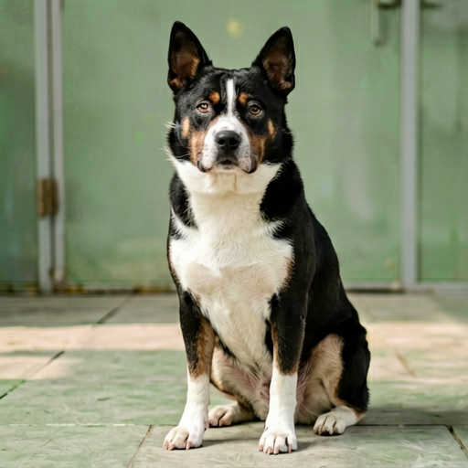

# ernie-image-mlx

Pure [MLX](https://github.com/ml-explore/mlx) port of Baidu [ERNIE-Image](https://huggingface.co/baidu/ERNIE-Image) — an 8B single-stream Diffusion Transformer for text-to-image generation on Apple Silicon.

> **Status:** Runnable end-to-end. All MLX modules parity-tested against diffusers (fp32 — DiT 3.1e-6, VAE encoder 1.7e-6, VAE decoder 6.7e-6, ResnetBlock2D 1e-5). Six checkpoint variants converted (fp16 / int8 / int4 × SFT / Turbo) and verified to produce clean images. The sample below was rendered by Turbo-q fp16 in 45 s on an M-series Mac with the prompt `一只黑白相间的中华田园犬` ("a black and white Chinese village dog"):

<p align="center"></p>

## Variants

Both checkpoints share the same architecture and load through the same class — only the scheduler steps and default guidance differ.

| Variant | HF repo | Steps | Guidance | MLX output size (fp16 / q8 / q4) |
|---|---|---|---|---|
| ERNIE-Image (SFT) | [`baidu/ERNIE-Image`](https://huggingface.co/baidu/ERNIE-Image) | 50 | ~5 | 22 GB / 12 GB / 6.4 GB |
| ERNIE-Image-Turbo (distilled) | [`baidu/ERNIE-Image-Turbo`](https://huggingface.co/baidu/ERNIE-Image-Turbo) | 8 | 1.0 | 22 GB / 12 GB / 6.4 GB |

## Install

```bash
git clone https://github.com/dgrauet/ernie-image-mlx.git
cd ernie-image-mlx
uv sync                      # runtime
uv sync --extra parity       # + PyTorch / diffusers / transformers for parity tests
```

Requires macOS with Apple Silicon and Python 3.11+.

## Quick start

```python
import os
os.environ["ERNIE_IMAGE_MLX_WEIGHTS_DIR"] = "/path/to/ernie-image-turbo-mlx"  # see "Convert weights" below

from ernie_image_core_mlx import ErnieImagePipeline

pipe = ErnieImagePipeline.from_pretrained("baidu/ERNIE-Image-Turbo")
out = pipe(
    "一只黑白相间的中华田园犬",            # Chinese prompts work best — the reference Prompt Enhancer
    height=512, width=512,                # expands user input during training; raw English prompts
    num_inference_steps=8,                # will be interpreted but are out-of-distribution
    guidance_scale=1.0,                   # turbo is CFG-distilled; use 4-5 with the SFT variant
    negative_prompt=None,
    seed=42,
)
out.images[0].save("dog.png")
```

`from_pretrained` resolution order: explicit `local_dir` → `ERNIE_IMAGE_MLX_WEIGHTS_DIR` env var → `huggingface_hub.snapshot_download(repo_id)` (only useful once an MLX build is uploaded to HF).

## CLI

`pip install -e .` (or `uv sync`) exposes a terminal entrypoint. Weights download on first use from `dgrauet/ernie-image-turbo-mlx-q8` (12 GB, int8 Turbo — the "ideal balance" row below):

```bash
ernie-image-mlx generate -p "一只黑白相间的中华田园犬" -o dog.png

# SFT variant at 50 steps with guidance 5
ernie-image-mlx generate -p "prompt" \
    --repo-id dgrauet/ernie-image-sft-mlx-q8 -s 50 -g 5.0 --seed 42

# Use a locally-converted checkpoint (mlx-forge convert ernie-image …)
ernie-image-mlx generate -p "prompt" --local-dir ~/models/ernie-image-turbo-mlx-q8
```

Defaults match the `ErnieImagePipeline`: 1024×1024, variant auto-detected from `--repo-id`, CFG implicitly disabled for Turbo (`guidance=1.0`). Pass `--no-cfg` to skip the uncond pass explicitly, or `--variant {turbo,sft}` to override detection when loading from `--local-dir`. Pass `--seed -1` to draw (and print) a fresh random seed — the integer is echoed to stdout so you can rerun with the exact value for reproducibility.

## Convert weights

MLX-native safetensors ship via the sibling [`mlx-forge`](https://github.com/dgrauet/mlx-forge) CLI:

```bash
# Download + convert Turbo at fp16
mlx-forge convert ernie-image --variant turbo
# int8 quantized (12 GB, recommended for 32 GB Macs)
mlx-forge convert ernie-image --variant turbo --quantize --bits 8
# int4 (6.4 GB, recommended for 16-24 GB Macs)
mlx-forge convert ernie-image --variant sft --quantize --bits 4
# Validate
mlx-forge validate ernie-image models/ernie-image-turbo-mlx
```

Output shape: split per-component safetensors (`transformer.safetensors`, `text_encoder.safetensors`, `vae.safetensors`) plus `transformer_config.json`, `vae_config.json`, `text_encoder_config.json`, and the [`mistral-community/pixtral-12b`](https://huggingface.co/mistral-community/pixtral-12b) tokenizer files bundled automatically (Baidu publishes only `tokenizer_config.json`, the vocabulary itself is pulled from the upstream Pixtral repo).

## Architecture

Extracted from `model_index.json` + per-component `config.json`:

| Component | Class | Config highlights |
|---|---|---|
| Transformer (DiT) | `ErnieImageTransformer2DModel` | 36 layers, hidden 4096, 32 heads (head_dim 128), FFN 12288, qk_layernorm, RoPE axes `[32, 48, 48]` (θ=256), text_in_dim 3072 |
| VAE | `AutoencoderKLFlux2` | 4 down/up blocks `[128, 256, 512, 512]`, latent 32 ch, patch 2×2, GroupNorm, SiLU; top-level `BatchNorm2d` for latent renormalisation |
| Text encoder | `Mistral3Model` (text path) | Ministral3 backbone: 26 layers, hidden 3072, 32 heads / 8 KV heads (GQA), head_dim 128, YaRN RoPE |
| Scheduler | `FlowMatchEulerDiscreteScheduler` | `mlx_arsenal.diffusion`, linear sigma schedule `linspace(1, 0, N+1)[:-1]` |
| Prompt Enhancer | `Ministral3ForCausalLM` | **Skipped in v0** — pass a pre-enhanced prompt for best results |

## Development

```bash
# Smoke suite (no weights, no torch)
uv run pytest tests/smoke

# Full parity suite (needs the [parity] extra; ~5 s total — all random-weight)
uv run pytest tests/parity -m parity
```

23 tests pass. Parity coverage: RoPE embedder, `apply_rotary_emb`, single-head and multi-head attention, FFN (GeGLU), shared-AdaLN block, AdaLN-continuous, full 2-layer DiT, ResnetBlock2D, VAE self-attention, full VAE encoder, full VAE decoder. Thresholds: < 1e-5 for layers, < 5e-3 for the full block, < 1e-4 for the small-config full model.

## Memory footprint at inference

| Unified RAM | Suggested variant | Notes |
|---|---|---|
| 96 GB+ | fp16 SFT | maximum quality, 50-step CFG |
| 48-64 GB | int8 SFT or fp16 Turbo | ~20 GB peak activations + weights |
| 24-32 GB | **int8 Turbo** | ideal balance — 12 GB weights, ~6 s / step at 512² |
| 16 GB | int4 Turbo | 6.4 GB weights; may need `mx.metal.set_memory_limit` for 1024² |

## Related projects

- [`mlx-forge`](https://github.com/dgrauet/mlx-forge) — weight-conversion CLI with the `ernie-image` recipe.
- [`mlx-arsenal`](https://github.com/dgrauet/mlx-arsenal) — reusable MLX ops (flow-match scheduler, `get_timestep_embedding`, pixel-shuffle, etc.).
- [`claude-skill-mlx-porting`](https://github.com/dgrauet/claude-skill-mlx-porting) — Claude Code skill capturing the workflow used to produce this port, including the two pitfalls (`#7` checkerboard, `#8` Tekken tokenizer BOS) that the port surfaced.

## License

MIT. ERNIE-Image weights and reference code are released by Baidu under Apache 2.0.
